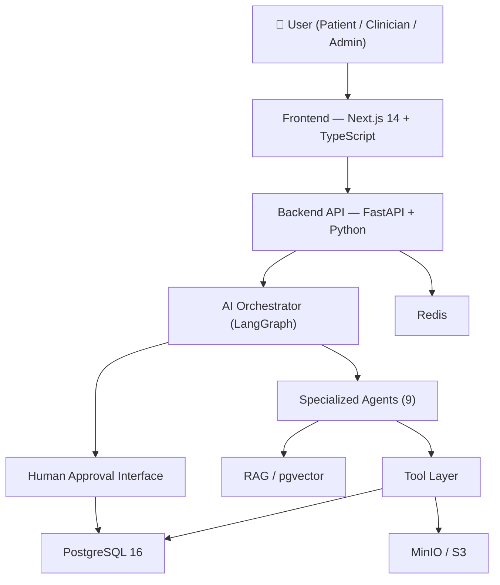
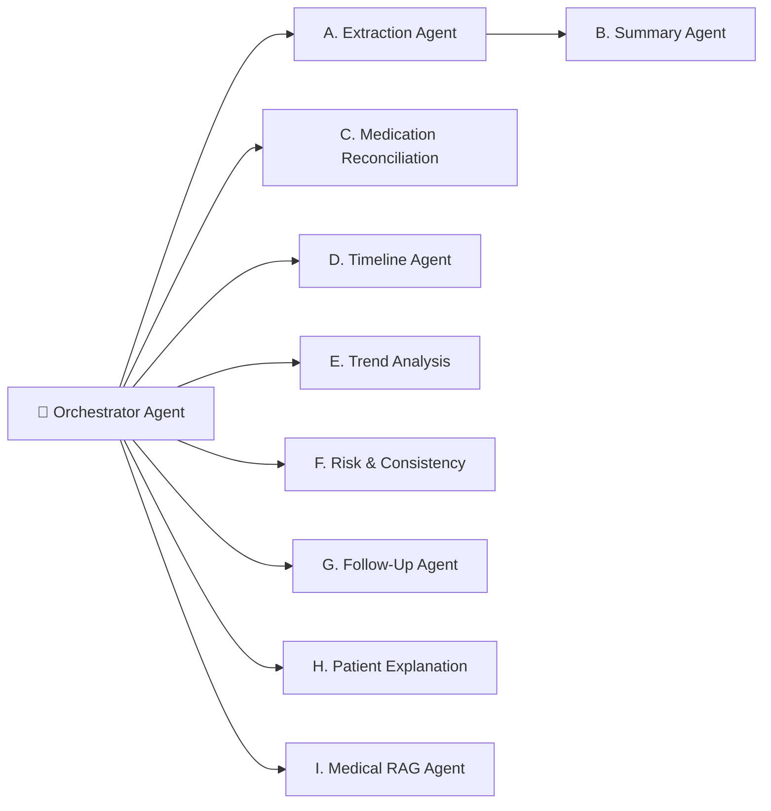

# MedFlow AI

## Overview

**MedFlow AI** is a production-quality agentic healthcare workflow assistant that helps patients and healthcare professionals organize, understand, and manage medical information using advanced AI.

> **⚠️ Important Disclaimer**: MedFlow AI provides information and workflow assistance. It does not replace professional medical judgment. All AI-generated clinical findings require human review and approval before any action is taken.

---

## Architecture



## Agent Architecture



---

## Tech Stack

| Layer | Technology |
|---|---|
| Frontend | Next.js 14, TypeScript, Tailwind CSS, shadcn/ui, Recharts |
| Backend | FastAPI, Python 3.11, Pydantic v2 |
| ORM | SQLAlchemy 2.0 + Alembic |
| Database | PostgreSQL 16 + pgvector |
| AI | OpenAI GPT-4o (or Mock AI mode) |
| Orchestration | LangGraph |
| Storage | MinIO (S3-compatible) |
| Queue | Redis + Celery |
| Auth | JWT + bcrypt |
| Containers | Docker + Docker Compose |

---

## Quick Start

### Prerequisites
- Docker & Docker Compose
- Node.js 20+ (for local frontend dev)
- Python 3.11+ (for local backend dev)

### 1. Clone and configure
```bash
git clone <repo>
cd medflow-ai
cp .env.example .env
# Edit .env — add OPENAI_API_KEY if available, otherwise MOCK_AI_MODE=true works
```

### 2. Start all services
```bash
docker compose up -d
```

Services:
- Frontend: http://localhost:3000
- Backend API: http://localhost:8000
- API Docs: http://localhost:8000/docs
- MinIO Console: http://localhost:9001 (medflow / medflow123)

### 3. Apply migrations
```bash
docker compose exec api alembic upgrade head
```

### 4. Seed demo data
```bash
docker compose exec api python -m app.scripts.seed_demo
```

### Demo Credentials

| Role | Email | Password |
|---|---|---|
| Patient | patient@demo.com | Demo1234! |
| Clinician | dr.smith@demo.com | Demo1234! |
| Admin | admin@demo.com | Demo1234! |

---

## Local Development (without Docker)

### Backend
```bash
cd apps/api
python -m venv venv
source venv/bin/activate  # or venv\Scripts\activate on Windows
pip install -e ".[dev]"
# Ensure PostgreSQL and Redis are running
alembic upgrade head
uvicorn app.main:app --reload
```

### Frontend
```bash
cd apps/web
npm install
npm run dev
```

---

## Environment Variables

See [.env.example](.env.example) for all configuration options.

Key variables:
- `OPENAI_API_KEY` — OpenAI API key. Leave empty to use Mock AI mode.
- `MOCK_AI_MODE` — Set `true` to use synthetic AI responses (no API key needed).
- `SECRET_KEY` — JWT signing key. Must be changed in production.
- `DATABASE_URL` — PostgreSQL connection string.

---

## API Documentation

Interactive API docs available at http://localhost:8000/docs (Swagger UI) and http://localhost:8000/redoc.

### Key Endpoints

```
POST /api/auth/register    — Register new user
POST /api/auth/login       — Login, receive JWT
GET  /api/auth/me          — Current user info

GET  /api/patients         — List patients (clinician/admin)
GET  /api/patients/{id}    — Patient profile

POST /api/patients/{id}/documents    — Upload medical document
GET  /api/patients/{id}/timeline     — Patient timeline
GET  /api/patients/{id}/medications  — Medications
GET  /api/patients/{id}/lab-results  — Lab results
GET  /api/patients/{id}/flags        — AI flags

POST /api/ai/chat                    — AI chat (RAG)
POST /api/ai/analyze-document        — Analyze document
POST /api/ai/flags/{id}/approve      — Approve AI flag
POST /api/ai/flags/{id}/reject       — Reject AI flag

GET  /api/audit-logs                 — Audit trail
```

---

## Safety & Privacy

- **No real patient data** — Use only synthetic/de-identified data.
- **AI never diagnoses** — All clinical findings require clinician approval.
- **Patient isolation** — Strict database-level access control prevents cross-patient data access.
- **Audit trail** — Every AI action is logged with full provenance.
- **Mock AI mode** — Full workflow demonstrations possible without an OpenAI key.

---

## Project Structure

```
medflow-ai/
├── apps/
│   ├── web/                    # Next.js 14 frontend
│   └── api/                    # FastAPI backend
│       └── app/
│           ├── agents/         # AI agents (9 specialized)
│           ├── api/            # Route handlers
│           ├── models/         # SQLAlchemy ORM models
│           ├── schemas/        # Pydantic schemas
│           ├── services/       # Business logic
│           ├── tools/          # Agent tools
│           ├── rag/            # RAG pipeline
│           ├── workflows/      # LangGraph workflows
│           ├── security/       # Auth & RBAC
│           └── workers/        # Celery tasks
├── infrastructure/
│   └── database/
└── docker-compose.yml
```

---

## Limitations

- Medical AI output is for informational purposes only
- Not HIPAA/GDPR certified (use only synthetic data)
- OCR quality depends on document clarity
- RAG retrieval quality depends on document chunking quality
- Mock AI mode provides realistic but synthetic responses

## Future Improvements

- FHIR integration
- Medical image analysis
- Voice assistant
- Wearable data integration
- Mobile application
- Email/SMS notifications
- Multilingual support
